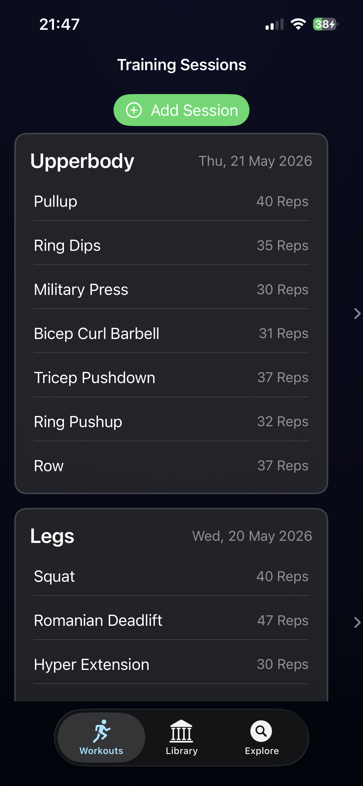
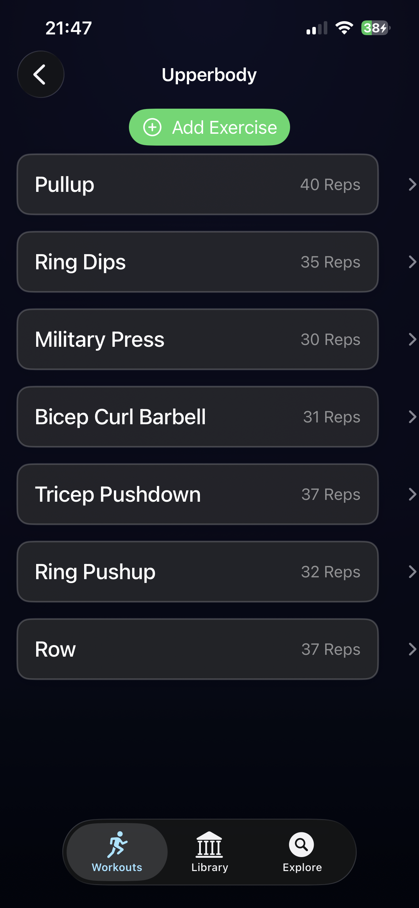
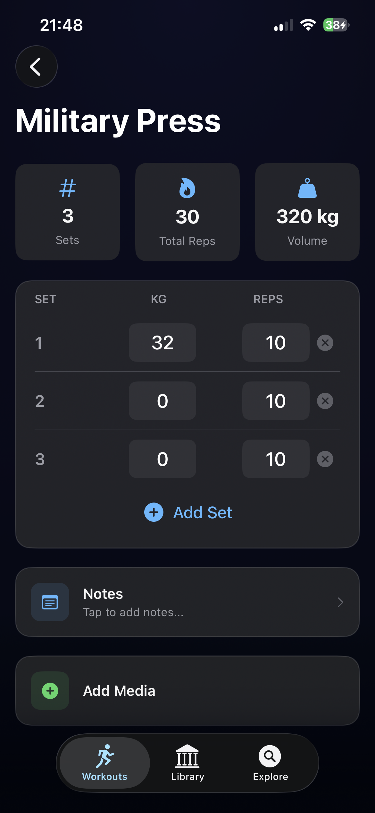
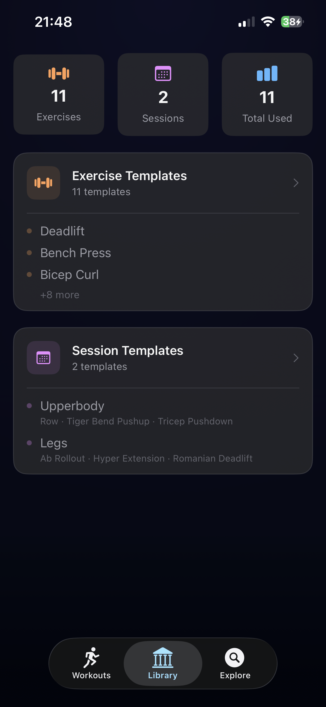
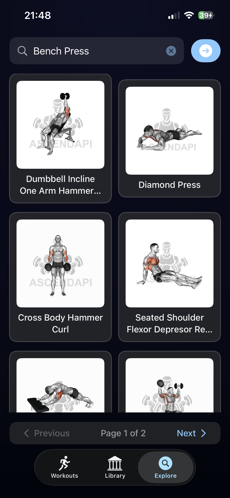
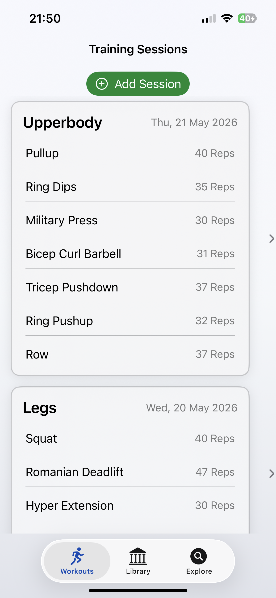

# repCounter

repCounter is an iOS fitness tracking app built with Swift and SwiftUI.

The app helps users document workout sessions, manage exercises, and track sets, repetitions, weight, and training volume. It was developed as a study project to gain practical experience in mobile app development and user-centered interface design.

## Features

- Create and manage workout sessions
- Add exercises to training sessions
- Track sets, repetitions, and weight per exercise
- View exercise details and workout summaries
- Use predefined exercise and session templates
- Search and browse exercises
- Supports dark and light mode

## Screenshots

### Workout Sessions

| Training Sessions | Exercise Overview | Exercise Detail |
| --- | --- | --- |
|  |  |  |

### Library and Search

| Templates | Exercise Search | Light Mode |
| --- | --- | --- |
|  |  |  |

## Tech Stack

- Swift
- SwiftUI
- Xcode
- iOS

## Getting Started

1. Clone the repository:

```bash
git clone https://github.com/Fatlum52/repCounter.git
```

1. Open the project in Xcode:

```bash
open repCounter.xcodeproj
```

1. Run the app on an iOS Simulator or on a physical iOS device.

## Project Status

This project was developed as a study project.  
The main goal was to build a functional iOS app for documenting workout sessions while applying common mobile app development concepts such as navigation, reusable views, user input handling, and state management.

## Future Improvements

- Add progress charts and training statistics
- Improve exercise filtering and categorization
- Add better data persistence and backup options
- Improve onboarding and user guidance
- Add export functionality for workout data

## Repository

GitHub: [Fatlum52/repCounter](https://github.com/Fatlum52/repCounter)
